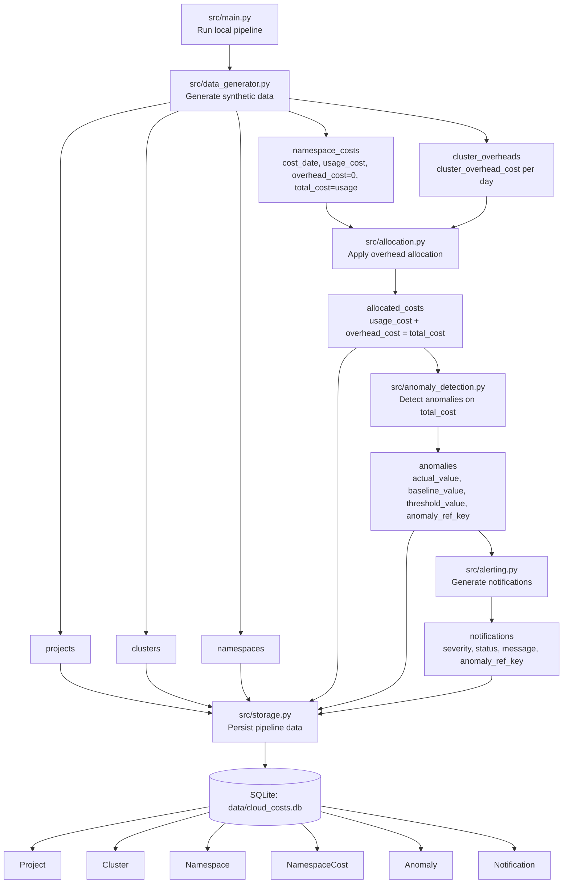

# Cloud Cost Analysis Prototype - Code-Aligned Data Flow Diagram

## End-to-End Model

Project -> Cluster -> Namespace -> NamespaceCost (usage + overhead = total) -> Anomaly -> Notification

Teams delivery was considered, but the final demo uses email notifications because no suitable Teams webhook was available.
